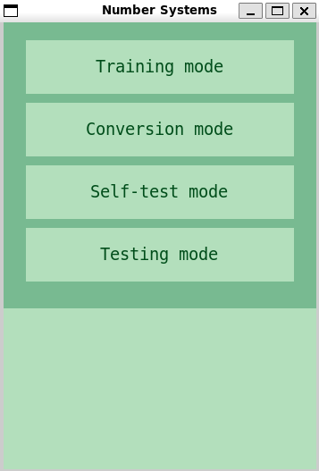
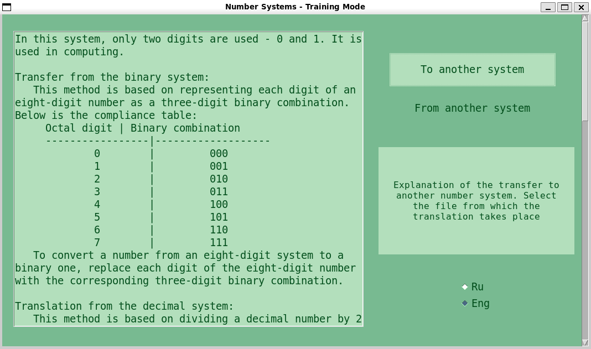
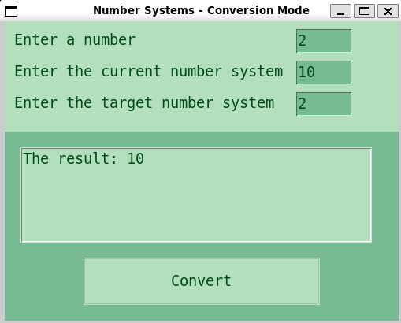
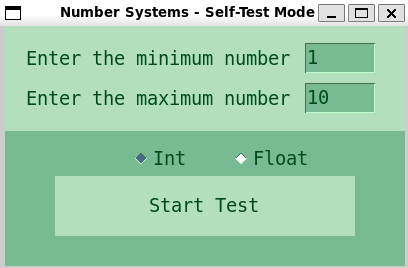
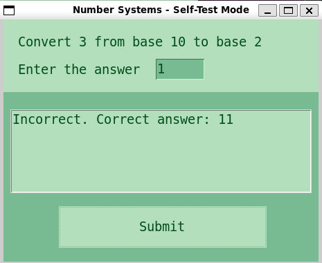
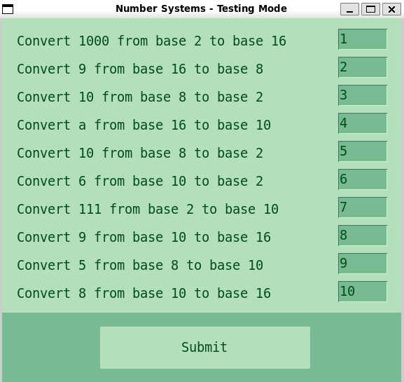
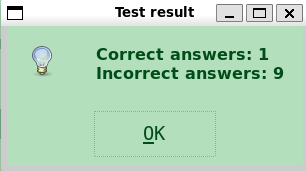

# Number_systems

## Contents

1. [Training mode](#training-mode)
2. [Conversion mode](#conversion-mode)
3. [Self-test mode](#Self-test-mode)
4. [Testing mode](#testing-mode)
5. [Systems](#systems)

The program "Number systems" is designed to teach translation into number systems 2, 8, 10, 16. The program performs the translation of numbers from one number system to another, and also works in various modes: training, conversion, self-testing and testing.

- training mode, which provides information on how to make a transfer; 
- conversion mode, when the program itself translates the number specified by the user from one specified number system to another; 
- self-test mode, when the program gives the user a translation task, then checks the correctness of the translation and, in case of an error, reports the correct answer;
- testing mode, when the program issues translation tasks to the user, then checks the correctness of the translation and gives the final result in the form: how many tasks were given, how many of them were done correctly, and how many were not.

## Training mode
Training mode, which provides information on how to make a transfer.

>The `display_tooltip` function displays a tooltip when the mouse hovers over a specific interface element. It takes three arguments: `event` (mouse hover event), `tooltip_label` (label on which the hint will be displayed) and `tooltip` (hint text). Inside the function, the hint text is set in the `text` field of the `tooltip_label` label.
>
>The `show_translation_info` function displays information about the translation of numeric systems. It takes two arguments: `direction` (the translation direction is "to" or "from") and `lang` (language is "1" for Russian or another meaning for English). Depending on the value of `lang`, the function sets the initial directory for selecting the translation file. Then a dialog box opens for selecting a file, and if the user has selected a file, its contents are displayed in the `info_text` text field.
>
>The `training_mode` function opens the training mode window of the program. She creates a new window using `Toplevel` and adjusts its size and background. Then a style is created for the radio buttons and the style settings are set. Two radio buttons are created to select the language (Russian or English) and placed on the window. The "To another system" and "From another system" buttons are created to display information about the translation of numeric systems and are placed on the window. For each button, event handlers for mouse hovering and cursor leaving the button are also installed, which call the `display_tooltip` function and clear the hint text. A label `tooltip_label` is created to display hints and a text field `info_text` to display information about the translation. Then a scroll bar is created for the text field and the window goes into the main display loop.

## Conversion mode
Conversion mode, when the program itself translates the number specified by the user from one specified number system to another; 

> The `valid_number(value)` function checks whether the value of `value` is a valid number. It converts the value to an integer and checks whether it belongs to one of the numeric systems: 2, 8, 10 or 16. The function returns `True` if the number is correct and non-negative, and `False` otherwise.
>
> The `number_system(value, system)` function checks whether the value of `value` corresponds to the numeric system `system`. It checks each character in the value of `value` and verifies that the characters are valid for a given numeric system. The function also checks that the dot separator characters are not repeated. The function returns `1` if the value of `value` corresponds to the numeric system `system`, and `0` otherwise.
>
> The `conversion_mode()` function creates a graphical interface for the conversion mode of numeric systems. It creates a top-level `root` window with certain settings and controls (labels, input fields and a text field). The function also declares the function `convert_and_display()`, which will be called when the conversion button is pressed.
>
> The `convert_and_display()` function checks the correctness of the entered values and converts a number from the current numeric system to the target numeric system using the `convert_number()` function from the `systems` module. If the conversion is successful, the function outputs the result in the text field `result_text`, otherwise an error message is displayed.

## Self-test mode
Self-test mode, when the program gives the user a translation task, then checks the correctness of the translation and, in case of an error, reports the correct answer;

>The `is_valid_number(value)` function checks whether the value of `value` is a valid number. It tries to convert the value to an integer and returns `True` if the conversion was successful and the value is greater than or equal to zero, otherwise it returns `False'.
>
>The `self_testing_mode()` function creates a self-test window and displays the controls: labels, input fields, radio buttons and a test start button. The function also creates an event handler for the test launch button, which reads values from input fields, checks them for validity, creates tasks for the test and displays them in a window.
>
>The `start_test()` function is an event handler for the test start button. It reads the values from the minimum and maximum number input fields, checks them for validity, creates a task for the test and displays it in the window. The function then creates labels and input fields for user responses and response validation results, and creates an event handler for the response validation button. The event handler compares the user's response with the correct response and outputs the verification result in the appropriate input field.
>
>The `answer(entries, tasks)` function is the event handler for the response verification button. It reads the user's response from the input field, converts a number from one number system to another using the `convert_number` function and compares the result with the user's response. Depending on the result of the comparison, the function outputs the corresponding text in the results field.

## Testing mode
Testing mode, when the program issues translation tasks to the user, then checks the correctness of the translation and gives the final result in the form: how many tasks were given, how many of them were done correctly, and how many were not.

>The `check_answers(entries, tasks)` function takes two arguments - a list of entries and a list of tasks. 
>
>The `correct_answers` and `incorrect_answers` variables are initialized inside the function to count correct and incorrect answers. Then the iteration through the entries list takes place using the `enumerate()` function. At each iteration, the `user_answer` value is obtained from the `entries` list using the get() method.
>
>Then the `convert_number()` function is called with the arguments `tasks[i][0]`, `tasks[i][1]`, `tasks[i][2]`. The return value is stored in the `converted_number` variable. After that, the `user_answer` is compared with the value of `converted_number`. If the values are equal, the `correct_answers` correct response counter is increased, otherwise the `incorrect_answers` incorrect response counter is increased. At the end of the iteration, an information window with the test results is displayed, which indicates the number of correct and incorrect answers.
>
>The `testing_mode()` function creates a new window using the Toplevel() object and configures it. Using the ttk.Label and ttk.Entry widgets, fields are created for entering minimum and maximum numbers. A StringVar object is created with the default value "int". Two radio buttons `int_btn` and `float_btn` are created with different values of the tpe variable and styles.
>
>Inside the `start_test()` function, values are obtained from the fields of the minimum and maximum numbers. If the values are not numbers or less than 0, an error message is displayed. The values are then converted to an integer type. The number is then converted from decimal to a string using `the convert_number()` function.The resulting value and the selected bases are added to the tasks list. A label and an input field are created for each task, which are added to the entries list. After creating all the labels and input fields, the `start_button` button and input fields are deleted using the `place_forget()` methods. A `submit_button` button is created, when clicked, the `check_answers()` function is executed with the entries and tasks arguments. 

## Systems
The `convert_number` function converts a number from one number system to another. It takes three arguments: `number` - the number to convert, `from_base` - the original number system, `to_base` - the target number system.

> First, the function checks that the source and target number systems are valid (2, 8, 16 or 10). If at least one of the number systems is not valid, the function returns the string "NULL".
> The function then checks that the number is not negative. If the number starts with the "-" character, the function returns the string "NULL".
> Next, the function divides the number into integer and decimal parts if there is a decimal point in the number. 
>
> If the number has a decimal part, the function converts the integer part of the number to an integer in the source number system, and then converts it to an integer in the target number system. The result of the conversion is stored in the `result_integer` variable. 
>
> Next, the function converts the decimal part of the number to an integer in the original number system. The function then performs division and remainder operations to convert the decimal part of the number to the target number system. The result of the conversion is stored in the `result_decimal` variable.
>
> Finally, the function checks the target number system and returns the result of converting the number in the appropriate format. If the target number system is 10, the result is represented as a string consisting of the integer and decimal parts of the number separated by a dot. If the target number system is 2, 8 or 16, the result is presented as a string consisting of the integer and decimal parts of the number converted to the corresponding number system, separated by a dot and without prefixes denoting the number system.
>
> If the number does not have a decimal part, the function converts the number to an integer in the source number system, and then converts it to an integer in the target number system. The conversion result is returned in the appropriate format, similar to the case with the decimal part of a number.
>
> 
> fratellou, 2023